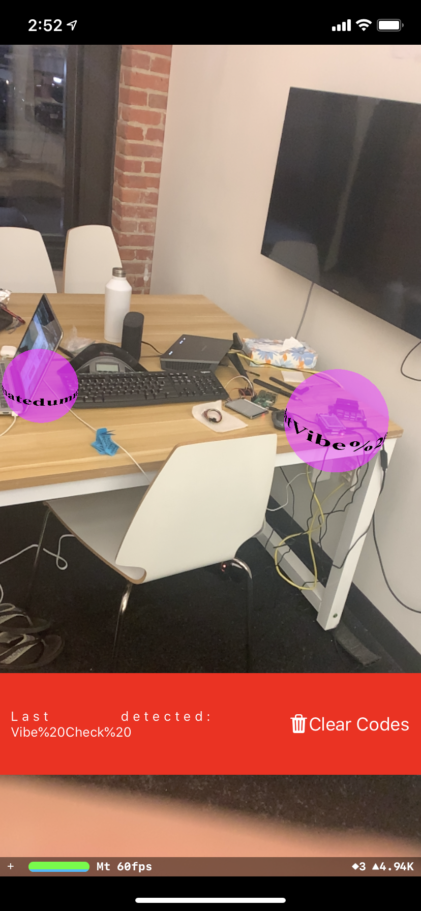

# frontend_ar

This code contains the AR app used for the ARmote application. This application 
was written in Swift, primarily using ARKit and UIKit. The application acts as 
the user front end. 

## Features

- Application can detect and be triggered by QRCodes and Lifi Targets
- When a target is detetected, a pink orb is rendered in AR. A pop up
notification is also displayed briefly to the user. The AR orb contains the 
name of the device scanned and is clickable. Once the nofication or the orb is 
clicked, the controller associated to the device is opened.
- Application has controllers for
  - Lights
  - Music Player
  - Locks
  - Climate Sensors

## LiFi
For more information regarding the how the lifi code works, see the [lifi
repo][lifi-repo].

## Configuration
Many project configuration variables can be tuned in the `cap/Constants.swift`
file. 

## Dependencies
Download OpenCV 4.2 for iOS from the [OpenCV releases][opencv] and put 
the `opencv2.framework` folder in `cap/libs`.

[lifi-repo]:https://github.com/capstone-winners/lifi
[opencv]:https://opencv.org/releases/
